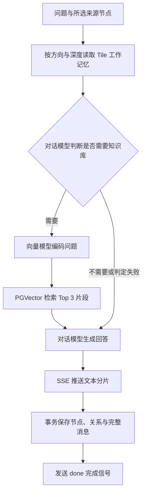

# Aureli Graph AI System

**把 AI 对话、便签与文件组织成可连接、可追溯的上下文图谱。**

Aureli（界面名称：Aureli Context Graph）是一个基于 Spring Boot、Spring AI 和 Vue 3 的图式 AI 工作台。项目以 **Tile（节点）** 为基本单元：每次问答可以独立开始，也可以显式关联已有节点，让模型沿指定关系读取历史信息，再按需检索共享知识库。

你可以在画布上拆解问题、记录想法、添加文档，并从一个或多个节点继续推演。节点内容、消息和关系保存到 PostgreSQL，支持刷新恢复；既可通过浏览器使用，也可通过 Electron 桌面窗口打开。

## 目录

- [项目能力](#项目能力)
- [上下文与知识检索](#上下文与知识检索)
- [技术栈](#技术栈)
- [项目结构](#项目结构)
- [快速开始](#快速开始)
- [数据库与 SQL 建表语句](#数据库与-sql-建表语句)
- [模型服务配置](#模型服务配置)
- [使用流程](#使用流程)
- [接口与流式协议](#接口与流式协议)
- [开发、测试与打包](#开发测试与打包)
- [常见问题与当前边界](#常见问题与当前边界)

## 项目能力

| 能力 | 当前实现 |
| --- | --- |
| 多图谱工作空间 | 在左侧 Dock 新建、点选切换图谱，各自管理 Tile、消息、关系和画布布局 |
| 图式问答 | 独立提问、从已有节点延伸、多节点关联、SSE 流式回答 |
| 手动拆分问答 | 选择单个已完成的 QA Tile，可附细分要求；AI 先判断拆分价值，拒绝时说明理由，通过后生成 2～4 个关联子问答 |
| AI 自动拆分建议 | 新提问先判断是否值得细分，弹窗展示子问题；取消保留草稿、否决只生成原问答、确认则原子生成原问答及 2～4 个 DIVIDES 子问答 |
| 便签节点 | 创建与编辑标题、正文和上下文来源，可作为后续问答的输入 |
| 文件节点 | 上传与下载附件，单文件最大 10 MB；PDF / DOCX 支持全页面文档预览，新上传时提取文字供 AI 读取 |
| 可控记忆 | 根据显式选择的节点、关系方向和遍历深度读取上下文 |
| 关系建模 | 单向／双向关系、关系类型、关系强度及关系说明 |
| 节点重要程度 | 普通、重要、非常重要三档；影响画布尺寸，并在上下文中提示模型关注程度 |
| 共享知识库 | Markdown 上传、异步向量化、处理状态、分页、备注编辑和删除 |
| 按需 RAG | 对话模型先判断是否需要专业资料，再通过 PGVector 检索最多 3 个文档片段 |
| 图谱操作 | 自由拖动、平移、缩放、适应画布、搜索、筛选、列表、全页面图谱与节点阅读 |
| 数据恢复与导出 | 从数据库同步节点和关系，导出包含画布布局的 JSON |
| 运行时模型配置 | 分别设置对话与向量模型，持久化配置、立即应用，并测试已保存的对话模型连接 |
| 示例模式 | 通过示例图谱体验操作；示例节点和知识库操作仅在浏览器内存中执行 |
| 桌面入口 | Electron 加载本地后端页面，复用网页工作台 |

## 上下文与知识检索

### 三类节点

- **QA**：问答节点，保存用户问题、回答摘要及完整消息。
- **NOTE**：便签节点，保存标题和正文；进入所选上下文范围后，正文作为用户参考信息提供给模型。
- **FILE**：文件节点，保存附件信息与原始二进制。PDF / DOCX 可在全页面视图中预览原文件的文字、图片及排版，DOCX 支持表格、页眉页脚和缩放，复杂版式可能与 Word 存在差异。新上传时提取文字到 `content`，供关联问答读取；AI 上下文仍只使用文字，不做 OCR；其他格式当前只保存和下载附件。

文件节点与知识库上传是两个入口。画布附件保存到数据库，不自动进入向量库；知识库中的 Markdown 保存到本地目录，解析后进入共享向量库。

### 工作记忆规则

1. 未选择来源节点时，不读取其他 Tile 的历史消息；当前问题仍可能触发共享知识库检索。
2. `relatedTileIds` 指定直接来源，`parentTileId` 为兼容旧调用方式的补充来源。
3. `memoryDepth = 0` 只读取直接选中的节点；大于 0 时，从这些节点继续按边数追溯。接口省略该字段时默认为 1，前端提问默认使用 3。
4. 有向边保存为「来源节点 → 新节点」，读取时反向追溯来源，避免沿来源节点的出边混入其他子分支；无向边可双向读取。
5. 在可读范围内，模型同时收到历史问答、便签正文、已提取的文件正文以及节点之间的关系。本次待保存的关系也会在回答前提供。
6. 节点权重 `weight` 为 1／2／3；关系强度 `edgeWeight` 为 0～1。两者独立，均不代表事实可信度，也不会扩大上下文读取范围。

### 一次问答的处理过程



RAG 判定使用当前对话模型，只有明确的肯定结果才检索。判定失败会继续使用工作记忆与通用回答能力；实际检索、生成或持久化失败时，回答流返回错误信息。前端只有收到 `done: true` 才确认回答完成。

## 技术栈

以下版本来自当前项目依赖配置，便于复现环境。

| 部分 | 技术与版本 |
| --- | --- |
| Java 后端 | Java 21、Spring Boot 4.1.0 |
| AI 接入 | Spring AI 2.0.0、OpenAI-compatible 对话与向量接口 |
| 数据访问 | MyBatis-Plus 3.5.16、PostgreSQL、PGVector、P6Spy |
| 文档处理 | Spring AI Markdown Reader、Apache POI 5.5.1（DOCX）、Apache PDFBox 3.0.8（PDF） |
| 网页前端 | Vue 3.5.43、Vite 8.3.2、Lucide Vue |
| 桌面窗口 | Electron 44.x |
| 日志与验证 | Log4j2、Jakarta Validation、JUnit、Node.js 测试 |

## 项目结构

Git 跟踪前后端源码、测试、必要静态资源、依赖清单、构建配置和项目文档。用户上传目录 `Markdown/`、`markdown/`、`knowledge-base/`、本机模型配置 `config/`、日志、依赖缓存、构建与测试产物及本机 IDE/代理设置不纳入版本管理；前端构建输出由 `frontend/` 源码重新生成。

`src/main/resources/application-dev.yml` 和 `application-prod.yml` 是本机环境配置，也不纳入 Git。新机器请将 `src/main/resources/application-profile.example.yml` 复制为所需环境配置，设置 `DATABASE_URL`、`DATABASE_USERNAME`、`DATABASE_PASSWORD` 和可选的 `MARKDOWN_STORAGE_PATH`；对话及向量模型继续使用 `application.yml` 中的环境变量配置。已有本机配置文件保留。

```text
.
├── README.md
├── pom.xml
├── frontend/
│   ├── src/
│   │   ├── App.vue                     # 工作台、知识库与页面状态
│   │   ├── components/                 # 图谱、提问、配置与阅读组件
│   │   ├── composables/                # 动效与画布交互
│   │   └── lib/                        # API 客户端、布局与示例数据
│   ├── tests/                          # 协议测试与浏览器验收脚本
│   └── vite.config.js                  # 开发代理和后端静态资源输出
├── desktop/                            # Electron 本地桌面入口
├── knowledge-base/                     # 示例知识文档，需手动上传入库
├── Markdown/                           # 本地知识库上传文件目录
├── config/                             # 旧模型配置文件的兼容迁移入口
├── design-system/                      # 界面设计规范
├── src/main/java/com/aureli/ai/robot/
│   ├── advisor/                        # 图记忆、RAG 与流式结果持久化
│   ├── controller/                     # 问答、节点、知识库与模型配置接口
│   ├── domain/                         # 数据实体与 Mapper
│   ├── event/                          # Markdown 上传事件与异步向量化
│   ├── prompt/                         # 集中维护的模型提示词
│   ├── reader/                         # Markdown、DOCX 与 PDF 文字读取
│   ├── service/                        # 业务服务及运行时模型配置
│   └── config/                         # 框架、跨域、线程池等配置
├── src/main/resources/
│   ├── application.yml                 # 公共配置，默认激活 dev
│   ├── application-dev.yml             # 本地数据库、向量库与文件目录
│   ├── application-prod.yml            # 现有生产环境配置片段
│   ├── schema.sql                      # 业务表初始化与兼容升级
│   ├── db/model-api-settings.sql        # 模型配置表单独初始化脚本
│   └── static/                         # 前端构建产物及旧版页面
└── src/test/java/                       # 后端单元与集成测试
```

## 快速开始

### 1. 准备环境

- **JDK 21** 与 Maven（建议 3.9+）。
- **Node.js 22.12+** 与 npm，满足当前前端与 Electron 的运行要求；仅前端开发也可使用 Node.js 20.19+。
- 可连接的 **PostgreSQL**，服务端已安装支持 HNSW 索引的 **PGVector 扩展**。
- 支持 OpenAI-compatible 协议的对话模型与向量模型服务。

以下命令从项目根目录开始执行。

### 2. 创建数据库和数据表

在 PostgreSQL 管理连接中执行，已有 `robot` 数据库时跳过：

```sql
CREATE DATABASE robot;
```

然后连接到 `robot`，执行下方 [完整建表 SQL](#数据库与-sql-建表语句)。使用 `psql` 时可通过以下命令进入数据库：

```bash
psql -h 127.0.0.1 -U postgres -d robot
```

**业务表与向量表的初始化不同**：`dev` 环境配置了 `spring.sql.init.mode=always`，启动时会执行 `schema.sql` 创建业务表并补齐部分旧字段；该脚本不包含向量表。当前也没有开启 PGVector 的 `initialize-schema`，因此首次运行必须手动创建扩展和 `t_vector_store`，或者自行显式开启向量库初始化。

### 3. 准备本地模型

以当前默认模型配置对应的 Ollama 为例，先启动服务：

```bash
ollama serve
```

另开终端拉取模型：

```bash
ollama pull llama3:latest
ollama pull qwen3-embedding:4b
```

向量模型必须实际返回 **1536 维**向量，与本项目的向量列和配置一致。其他 OpenAI-compatible 服务可在页面中配置自己的地址与模型名称。

### 4. 设置数据库和模型地址

当前开发配置中的数据库默认为本机 `robot`，用户名与密码均为 `postgres`；Markdown 路径是原开发机器的绝对路径。请改成自己的配置，或使用环境变量覆盖数据库参数：

```bash
export SPRING_DATASOURCE_URL='jdbc:p6spy:postgresql://127.0.0.1:5432/robot'
export SPRING_DATASOURCE_USERNAME='postgres'
export SPRING_DATASOURCE_PASSWORD='your-database-password'
export OLLAMA_BASE_URL='http://127.0.0.1:11434/v1'
export OLLAMA_API_KEY='ollama'
export OLLAMA_CHAT_MODEL='llama3:latest'
export OLLAMA_EMBEDDING_MODEL='qwen3-embedding:4b'
```

保留 `jdbc:p6spy:postgresql:` 前缀可继续使用当前配置的 P6Spy 驱动。若改为普通 `jdbc:postgresql:` 地址，应同时将驱动类改成 `org.postgresql.Driver`。

### 5. 构建页面并启动后端

先在前端目录安装依赖并构建：

```bash
cd frontend
npm ci
npm run build
cd ..
```

前端资源直接输出到 `src/main/resources/static`。回到项目根目录启动后端，并覆盖知识文件目录：

```bash
mvn spring-boot:run -Dspring-boot.run.arguments="--customer-service.md-storage-path=$PWD/Markdown"
```

打开 [http://127.0.0.1:8080](http://127.0.0.1:8080)。在「服务设置」中确认实际生效的模型配置，保存后测试对话模型连接。

如果数据库已有模型配置，或根目录存在可迁移的旧 `config/model-api-settings.json`，它们会优先于本次环境变量中的模型初始值。页面显示的配置是判断实际调用地址的依据。

### 6. 可选：打开桌面窗口

保持后端运行，在另一个终端执行：

```bash
cd desktop
npm ci
npm start
```

当前 Electron 入口固定加载 `http://127.0.0.1:8080`；它只负责打开窗口，后端和数据库需要单独启动。

## 数据库与 SQL 建表语句

### 表与数据归属

| 表名 | 用途 |
| --- | --- |
| `t_map` | 图谱 ID、名称、缩放比例（zoom）和创建／更新时间，支持空图谱 |
| `t_tile` | 三类节点、标题、正文、问答摘要、重要程度与附件二进制 |
| `t_tile_message` | QA 节点的完整用户／助手消息 |
| `t_tile_edge` | 节点关系、方向、类型、强度与说明 |
| `t_ai_customer_service_md_storage` | 知识库 Markdown 的文件路径、大小、处理状态与备注 |
| `t_model_api_settings` | 唯一一条对话／向量模型配置，固定 `id = 1` |
| `t_vector_store` | 知识文档片段、来源元数据与 1536 维向量 |

三张 Tile 表均通过 `map_id` 归属图谱；消息和关系使用 `(map_id, tile_id)` 复合外键关联节点，禁止跨图谱连边和保存消息。Tile ID 保持全局唯一。后端启动不创建图谱，三张 Tile 表的 `map_id` 必须显式赋值；旧版未分配归属的数据需先指定图谱再升级。节点删除后，相应消息和关系通过外键级联删除。向量与知识文件通过 `metadata.mdStorageId` 在业务层关联，不使用数据库外键。

### 完整初始化 SQL

下面的 SQL 在 **已连接到 `robot` 数据库**的前提下执行。业务表与当前 `schema.sql` 一致，额外补上与 Spring AI PGVector 存储格式对应的向量表及余弦距离 HNSW 索引。创建扩展需要相应数据库权限，`vector` 扩展需先安装在 PostgreSQL 服务端。

```sql
-- 1. 启用扩展。
CREATE EXTENSION IF NOT EXISTS vector;
CREATE EXTENSION IF NOT EXISTS hstore;
CREATE EXTENSION IF NOT EXISTS "uuid-ossp";

-- 2. 初始化业务表，并兼容旧版 Tile 字段。
CREATE TABLE IF NOT EXISTS t_map (
    id BIGSERIAL PRIMARY KEY,
    map_id VARCHAR(128) NOT NULL UNIQUE,
    name VARCHAR(100) NOT NULL,
    zoom NUMERIC(7, 6) NOT NULL DEFAULT 1.0 CONSTRAINT chk_map_zoom CHECK (zoom BETWEEN 0.35 AND 1.5),
    create_time TIMESTAMP NOT NULL DEFAULT CURRENT_TIMESTAMP,
    update_time TIMESTAMP NOT NULL DEFAULT CURRENT_TIMESTAMP
);
-- 旧图谱默认使用 100% 缩放；与画布支持的 35%–150% 范围一致。
ALTER TABLE t_map ADD COLUMN IF NOT EXISTS zoom NUMERIC(7, 6) NOT NULL DEFAULT 1.0
    CONSTRAINT chk_map_zoom CHECK (zoom BETWEEN 0.35 AND 1.5);

CREATE TABLE IF NOT EXISTS t_tile (
    id BIGSERIAL PRIMARY KEY,
    tile_id VARCHAR(128) NOT NULL UNIQUE,
    title VARCHAR(255),
    tile_type VARCHAR(16) NOT NULL DEFAULT 'QA' CONSTRAINT chk_tile_type CHECK (tile_type IN ('QA', 'NOTE', 'FILE')),
    content TEXT,
    file_name VARCHAR(512),
    file_content_type VARCHAR(128),
    file_size BIGINT,
    file_data BYTEA,
    user_message TEXT,
    answer_summary TEXT,
    weight SMALLINT NOT NULL DEFAULT 1 CONSTRAINT chk_tile_weight CHECK (weight IN (1, 2, 3)),
    create_time TIMESTAMP NOT NULL DEFAULT CURRENT_TIMESTAMP,
    update_time TIMESTAMP NOT NULL DEFAULT CURRENT_TIMESTAMP
);

-- 兼容尚未添加节点权重的既有工作区；已存在该列时保留原有值。
ALTER TABLE t_tile ADD COLUMN IF NOT EXISTS weight SMALLINT NOT NULL DEFAULT 1
    CONSTRAINT chk_tile_weight CHECK (weight IN (1, 2, 3));

-- 升级既有工作区：原问答数据保留并自动标记为 QA。
ALTER TABLE t_tile ADD COLUMN IF NOT EXISTS tile_type VARCHAR(16) NOT NULL DEFAULT 'QA'
    CONSTRAINT chk_tile_type CHECK (tile_type IN ('QA', 'NOTE', 'FILE'));
ALTER TABLE t_tile ADD COLUMN IF NOT EXISTS content TEXT;
ALTER TABLE t_tile ADD COLUMN IF NOT EXISTS file_name VARCHAR(512);
ALTER TABLE t_tile ADD COLUMN IF NOT EXISTS file_content_type VARCHAR(128);
ALTER TABLE t_tile ADD COLUMN IF NOT EXISTS file_size BIGINT;
ALTER TABLE t_tile ADD COLUMN IF NOT EXISTS file_data BYTEA;

CREATE TABLE IF NOT EXISTS t_tile_message (
    id BIGSERIAL PRIMARY KEY,
    tile_id VARCHAR(128) NOT NULL,
    role VARCHAR(32) NOT NULL,
    content TEXT NOT NULL,
    create_time TIMESTAMP NOT NULL DEFAULT CURRENT_TIMESTAMP,
    CONSTRAINT fk_tile_message_tile
        FOREIGN KEY (tile_id)
        REFERENCES t_tile (tile_id)
        ON DELETE CASCADE
);

CREATE INDEX IF NOT EXISTS idx_t_tile_message_tile_time
    ON t_tile_message (tile_id, create_time ASC);

CREATE TABLE IF NOT EXISTS t_tile_edge (
    id BIGSERIAL PRIMARY KEY,
    edge_id VARCHAR(128) NOT NULL UNIQUE,
    source_tile_id VARCHAR(128) NOT NULL,
    target_tile_id VARCHAR(128) NOT NULL,
    direction VARCHAR(32) NOT NULL,
    relation_type VARCHAR(64) NOT NULL,
    weight NUMERIC(5, 4) NOT NULL DEFAULT 1.0000,
    description TEXT,
    create_time TIMESTAMP NOT NULL DEFAULT CURRENT_TIMESTAMP,
    update_time TIMESTAMP NOT NULL DEFAULT CURRENT_TIMESTAMP,
    CONSTRAINT fk_tile_edge_source
        FOREIGN KEY (source_tile_id)
        REFERENCES t_tile (tile_id)
        ON DELETE CASCADE,
    CONSTRAINT fk_tile_edge_target
        FOREIGN KEY (target_tile_id)
        REFERENCES t_tile (tile_id)
        ON DELETE CASCADE,
    CONSTRAINT chk_tile_edge_direction
        CHECK (direction IN ('DIRECTED', 'UNDIRECTED')),
    CONSTRAINT chk_tile_edge_weight
        CHECK (weight >= 0 AND weight <= 1),
    CONSTRAINT chk_tile_edge_not_self
        CHECK (source_tile_id <> target_tile_id)
);

CREATE INDEX IF NOT EXISTS idx_t_tile_edge_source
    ON t_tile_edge (source_tile_id);

CREATE INDEX IF NOT EXISTS idx_t_tile_edge_target
    ON t_tile_edge (target_tile_id);

CREATE INDEX IF NOT EXISTS idx_t_tile_edge_relation_type
    ON t_tile_edge (relation_type);

-- 多图谱字段必须显式赋值；不创建图谱，也不为旧数据推断归属。
-- 若尚有未分配图谱的旧数据，应先明确归属再升级，避免无意删除。
ALTER TABLE t_tile ADD COLUMN IF NOT EXISTS map_id VARCHAR(128);
ALTER TABLE t_tile_message ADD COLUMN IF NOT EXISTS map_id VARCHAR(128);
ALTER TABLE t_tile_edge ADD COLUMN IF NOT EXISTS map_id VARCHAR(128);
ALTER TABLE t_tile ALTER COLUMN map_id DROP DEFAULT;
ALTER TABLE t_tile_message ALTER COLUMN map_id DROP DEFAULT;
ALTER TABLE t_tile_edge ALTER COLUMN map_id DROP DEFAULT;
ALTER TABLE t_tile ALTER COLUMN map_id SET NOT NULL;
ALTER TABLE t_tile_message ALTER COLUMN map_id SET NOT NULL;
ALTER TABLE t_tile_edge ALTER COLUMN map_id SET NOT NULL;

CREATE UNIQUE INDEX IF NOT EXISTS idx_t_tile_map_tile ON t_tile (map_id, tile_id);
CREATE INDEX IF NOT EXISTS idx_t_tile_map_order ON t_tile (map_id, id);
CREATE INDEX IF NOT EXISTS idx_t_tile_message_map_tile_time ON t_tile_message (map_id, tile_id, create_time);
CREATE INDEX IF NOT EXISTS idx_t_tile_edge_map_source ON t_tile_edge (map_id, source_tile_id);
CREATE INDEX IF NOT EXISTS idx_t_tile_edge_map_target ON t_tile_edge (map_id, target_tile_id);

-- 重复启动可重入；复合外键确保消息、边的两个端点与 Tile 属于同一个 Map。
ALTER TABLE t_tile DROP CONSTRAINT IF EXISTS fk_tile_map;
ALTER TABLE t_tile ADD CONSTRAINT fk_tile_map FOREIGN KEY (map_id) REFERENCES t_map (map_id) ON DELETE CASCADE;
ALTER TABLE t_tile_message DROP CONSTRAINT IF EXISTS fk_tile_message_tile;
ALTER TABLE t_tile_message ADD CONSTRAINT fk_tile_message_tile FOREIGN KEY (map_id, tile_id)
    REFERENCES t_tile (map_id, tile_id) ON DELETE CASCADE;
ALTER TABLE t_tile_edge DROP CONSTRAINT IF EXISTS fk_tile_edge_source;
ALTER TABLE t_tile_edge ADD CONSTRAINT fk_tile_edge_source FOREIGN KEY (map_id, source_tile_id)
    REFERENCES t_tile (map_id, tile_id) ON DELETE CASCADE;
ALTER TABLE t_tile_edge DROP CONSTRAINT IF EXISTS fk_tile_edge_target;
ALTER TABLE t_tile_edge ADD CONSTRAINT fk_tile_edge_target FOREIGN KEY (map_id, target_tile_id)
    REFERENCES t_tile (map_id, tile_id) ON DELETE CASCADE;

CREATE TABLE IF NOT EXISTS t_ai_customer_service_md_storage (
    id BIGSERIAL PRIMARY KEY,
    original_file_name VARCHAR(512) NOT NULL,
    new_file_name VARCHAR(512) NOT NULL,
    file_path VARCHAR(1024) NOT NULL,
    file_size BIGINT NOT NULL,
    status INTEGER NOT NULL,
    remark VARCHAR(1024),
    create_time TIMESTAMP NOT NULL DEFAULT CURRENT_TIMESTAMP,
    update_time TIMESTAMP NOT NULL DEFAULT CURRENT_TIMESTAMP
);

-- PostgreSQL: 服务设置。首次启动从旧 JSON 或 application.yml 初始化唯一配置记录。
CREATE TABLE IF NOT EXISTS t_model_api_settings (
    id SMALLINT PRIMARY KEY DEFAULT 1 CHECK (id = 1),
    chat_provider VARCHAR(16) NOT NULL CHECK (chat_provider IN ('local', 'openai')),
    chat_base_url TEXT NOT NULL,
    chat_model VARCHAR(200) NOT NULL,
    chat_api_key VARCHAR(4096) NOT NULL,
    embedding_provider VARCHAR(16) NOT NULL CHECK (embedding_provider IN ('local', 'openai')),
    embedding_base_url TEXT NOT NULL,
    embedding_model VARCHAR(200) NOT NULL,
    embedding_api_key VARCHAR(4096) NOT NULL,
    dimensions INTEGER NOT NULL CHECK (dimensions > 0),
    create_time TIMESTAMP NOT NULL DEFAULT CURRENT_TIMESTAMP,
    update_time TIMESTAMP NOT NULL DEFAULT CURRENT_TIMESTAMP
);

-- 3. 初始化共享知识库向量表。
CREATE TABLE IF NOT EXISTS public.t_vector_store (
    id UUID DEFAULT uuid_generate_v4() PRIMARY KEY,
    content TEXT,
    metadata JSON,
    embedding VECTOR(1536)
);

CREATE INDEX IF NOT EXISTS t_vector_store_index
    ON public.t_vector_store
    USING HNSW (embedding vector_cosine_ops);
```

`IF NOT EXISTS` 适合重复初始化，但不会自动调整已有字段类型、向量维度或索引定义。业务表升级以 [`schema.sql`](src/main/resources/schema.sql) 中的兼容语句为准；只有模型配置表需要补建时，也可使用 [`db/model-api-settings.sql`](src/main/resources/db/model-api-settings.sql)。

移除旧的空 `default` 图谱可执行 `src/main/resources/db/remove-default-map.sql`；已有 Tile 的图谱会保留。移除后重复启动不会重新创建。

时间字段没有自动更新时间触发器，修改时间由业务代码维护。模型配置表初始化为空即可，首次启动会写入配置，不需要手工插入 API Key。

### 向量维度与知识文件状态

以下三处必须一致，当前均为 `1536`：

- 向量模型实际返回的维度与 `spring.ai.openai.embedding.dimensions`。
- `spring.ai.vectorstore.pgvector.dimensions`。
- `t_vector_store.embedding` 的 `VECTOR(1536)` 类型。

运行时设置接口不能改变当前维度。更换向量模型，即使维度相同，也应重新向量化知识文档，避免把不同模型的向量混合检索；当前没有自动重建入口，可在处理结束后删除并重新上传文档。调整维度还需要同步迁移向量表、启动配置及已保存的模型配置。

| `status` | 状态 | 页面行为 |
| --- | --- | --- |
| 0 | 待处理 | 等待异步任务，不允许删除 |
| 1 | 向量化中 | 知识库页面自动轮询，不允许删除 |
| 2 | 已完成 | 可以检索、编辑备注或删除 |
| 3 | 处理失败 | 检查模型与数据库配置，删除后重新上传 |

Markdown 入库以 10 个文档为一批调用向量存储；片段 ID 由文件记录 ID 和片段内容共同生成，避免相同正文的不同文件互相覆盖来源关系。

## 模型服务配置

### 启动配置与运行时设置

| 配置项 | 当前默认值 | 作用 |
| --- | --- | --- |
| `server.port` | `8080` | 后端与同源网页端口 |
| `spring.profiles.active` | `dev` | 默认运行环境 |
| `OLLAMA_BASE_URL` | `http://192.168.0.106:11434/v1` | 对话与向量模型的初始／兜底地址 |
| `OLLAMA_API_KEY` | `ollama` | 初始／兜底模型密钥 |
| `OLLAMA_CHAT_MODEL` | `llama3:latest` | 初始／兜底对话模型 |
| `OLLAMA_EMBEDDING_MODEL` | `qwen3-embedding:4b` | 初始／兜底向量模型 |
| `customer-service.temperature` | `0.0` | 对话生成温度 |
| `customer-service.md-storage-path` | 开发机器的绝对路径 | 知识库 Markdown 保存目录，运行前需要覆盖 |
| `spring.servlet.multipart.max-file-size` | `10MB` | 单文件上传上限 |
| `spring.servlet.multipart.max-request-size` | `11MB` | 整个上传请求上限 |

「服务设置」中的 **项目服务地址**是浏览器访问本项目后端的地址；**模型 Base URL**是后端访问模型服务的地址。例如，本机工作台可使用 `http://127.0.0.1:8080`，模型则使用 `http://127.0.0.1:11434/v1`。

对话与向量配置可分别选择 `local` 或 `openai`，两种来源都使用 OpenAI-compatible 协议，可指向不同服务。保存成功后，本实例的后续问答、文档向量化与检索立即使用新配置。

### 配置恢复顺序

1. `t_model_api_settings` 已有记录时，优先恢复数据库配置。
2. 表为空时，尝试迁移旧 `config/model-api-settings.json`。
3. 没有旧文件时，使用启动配置初始化数据库记录。
4. 模型配置数据库读取或初始化发生数据访问错误时，使用启动配置兜底；其他依赖数据库的功能仍需数据库可用。

读取接口只返回 `keyConfigured`，不会返回密钥原文。密钥留空时，仅在来源和地址均未改变的情况下保留原密钥；本地来源无密钥时使用 `ollama` 占位值。数据库中的密钥字段当前保存原值，应限制配置表和备份的访问权限。

「测试链接」使用后端**已保存的对话模型配置**发送固定测试消息，返回模型名称和回复。它不会保存页面中的草稿，也不会验证向量模型；向量模型需要通过文档上传与实际检索验证。

## 使用流程

1. 打开工作台，在左侧「图谱工作台」下点选图谱；点击「新建图谱」创建独立工作空间。原有数据位于「默认图谱」。
2. 在服务设置中保存对话与向量模型配置，测试对话服务连接。
3. 新建独立问答，或先添加便签、文件节点。需要使用 PDF / DOCX 文字时，通过画布文件入口上传。
4. 选择一个或多个上下文来源，设置关系方向、类型和说明，再发起问题。
5. 调整节点重要程度、拖动布局，通过节点详情或全页面视图阅读完整内容。
6. 需要共享知识时，在知识库页面上传 `.md` 文件，等待状态变成「已完成」。
7. 刷新或同步恢复持久化内容，导出 JSON 留存图谱和当前布局。

节点手动位置保存在当前浏览器，按示例／真实模式、服务地址和图谱 ID 区分。生成回答时可以切换图谱，回答继续保存到原图谱；最近使用的图谱通过浏览器和 URL 的 `map` 参数恢复。各图谱的缩放比例自动保存到 `t_map.zoom`，切换和刷新时恢复，默认 100%；普通画布和全页面图谱共用该比例。真实图谱以数据库中保存的比例为准，覆盖 URL 中过期的 `zoom` 值。内容和关系由后端保存，位置不在不同浏览器或设备之间同步。示例模式下的节点与知识库操作不提交后端，但服务设置仍操作真实后端配置。

## 接口与流式协议

所有接口以 `/customer-service` 为前缀。

| 方法 | 路径 | 用途 |
| --- | --- | --- |
| `POST` | `/chat/tile/completion` | 发起 Tile 问答，返回 SSE |
| `GET` | `/maps` | 列出已有图谱 |
| `POST` | `/maps` | 新建图谱，请求体为 `{"name":"图谱名称"}` |
| `DELETE` | `/maps/{mapId}` | 删除图谱及其全部 Tile、消息、附件和关系，前端需要确认 |
| `POST` | `/maps/{mapId}/zoom` | 保存图谱缩放比例，请求体为 `{"zoom":0.75}`，范围 0.35–1.5 |
| `GET` | `/tile/workspace?mapId=…` | 返回指定图谱的节点、关系及最新完整回答 |
| `POST` | `/tile/note` | 创建便签，支持关联来源 |
| `POST` | `/tile/note/update` | 修改便签与来源关系 |
| `POST` | `/tile/file` | 上传画布附件，返回文件节点 |
| `GET` | `/tile/{tileId}/file` | 下载原始附件 |
| `POST` | `/tile/weight` | 设置节点重要程度 1／2／3 |
| `POST` | `/tile/delete` | 删除单个节点及其消息、附件与关系 |
| `POST` | `/tile/reset` | 清空指定图谱的节点、消息和关系，请求体为 `{"mapId":"…"}` |
| `POST` | `/md/upload` | 上传 Markdown 并触发异步向量化 |
| `POST` | `/md/list` | 分页查询知识文件 |
| `POST` | `/md/update` | 修改知识文件备注 |
| `POST` | `/md/delete` | 删除知识文件、记录和关联向量 |
| `GET` | `/model-settings` | 读取脱敏后的模型配置 |
| `POST` | `/model-settings` | 保存并应用对话／向量模型配置 |
| `POST` | `/model-settings/test` | 测试已保存的对话模型连接 |

所有 Tile 读写请求均必须提供 `mapId`：JSON 请求放在请求体，附件上传放在表单，画布读取与附件下载放在查询参数。省略时返回参数错误。知识库和模型配置仍为共享设置。

### 问答请求示例

`tileId` 用于标识当前问答节点，新建时应使用新的 ID。下面使用 `memoryDepth: 0`，只读两个直接来源；来源 ID 需替换成工作区中实际存在的节点。

```bash
curl -N 'http://127.0.0.1:8080/customer-service/chat/tile/completion' \
  -H 'Content-Type: application/json' \
  -H 'Accept: text/event-stream' \
  --data '{
    "tileId": "tile-example-new",
    "mapId": "map-example",
    "message": "根据这两个节点，整理一份实施建议。",
    "relatedTileIds": ["tile-source-a", "tile-source-b"],
    "memoryDepth": 0,
    "edgeDirection": "DIRECTED",
    "relationType": "EXTENDS",
    "edgeWeight": 1,
    "edgeDescription": "结合两个来源继续推演"
  }'
```

独立提问使用 `relatedTileIds: []` 并省略 `parentTileId`。普通提问的关系类型由方向固定为 `EXTENDS` / `RELATES`，融合和拆分接口分别创建 `FUSES` / `DIVIDES`；便签与附件关联默认采用 `DIRECTED`、`EXTENDS` 和强度 1。

### SSE 完成语义

以下只展示有效字段，实际 JSON 可能同时包含值为 `null` 的其他字段：

```text
data: {"v":"根据已有信息，"}

data: {"v":"可以分三步实施。"}

data: {"done":true}

```

失败流返回：

```text
data: {"error":"回答生成或保存失败，请检查模型服务连接后重试。"}

```

`v` 是文本增量，`done: true` 表示生成及数据库保存成功。单纯断开连接不等于完成；读取到部分文本后仍可能因保存失败收到 `error`，此时页面应保持失败状态。

普通业务接口使用 `{ "success": true, "data": ... }` 形式的响应。调用方需同时检查 HTTP 状态和 `success`；分页结果的 `total`、`current`、`size`、`pages` 与 `data` 同级。附件下载直接返回二进制。

上传接口使用 `multipart/form-data`，文件字段名均为 `file`；画布附件的可选来源通过重复的 `relatedTileIds` 字段提交。更多请求结构与前端处理约定见 [`frontend/API-CONTRACT.md`](frontend/API-CONTRACT.md)。

## 开发、测试与打包

### 前后端分开开发

先启动后端，再运行：

```bash
cd frontend
npm ci
npm run dev
```

默认开发地址为 [http://127.0.0.1:5173](http://127.0.0.1:5173)，以终端实际输出为准。Vite 将 `/customer-service` 代理到 `http://localhost:8080`；后端端口调整后，需要同步修改开发代理。更多前端说明见 [`frontend/README.md`](frontend/README.md)。

### 验证

不依赖真实数据库或外部模型的后端定向测试：

```bash
mvn -Dtest=CustomChatMemoryAdvisorTest,TileCompletionProtocolTest,TileKnowledgeRoutingTest,TileWorkspaceControllerTest,TileWeightControllerTest,TileArtifactControllerTest,TileFileContentReaderTest,MarkdownVectorOwnershipTest,CustomerServiceTileDeletionTest,ModelApiSettingsServiceTest,ModelApiSettingsControllerTest test
```

配置好数据库及本地环境后，执行默认后端测试：

```bash
mvn test
```

默认测试包含 Spring Boot 上下文和数据库访问测试，不能全部视为离线测试。另有通过系统属性显式开启的 PostgreSQL 集成测试，应在独立测试数据库中运行，具体条件见对应测试类。

前端自动测试：

```bash
cd frontend
npm test
```

该命令执行 `tests/*.test.js` 中的接口、SSE 和图谱布局测试，不包含所有浏览器验收脚本。`tests/*.smoke.mjs` 需要额外可用的 Playwright 和浏览器环境；历史真实服务联调记录见 [`frontend/LIVE-INTEGRATION.md`](frontend/LIVE-INTEGRATION.md)。

### 打包运行

先生成前端资源，再打包后端：

```bash
cd frontend
npm ci
npm run build
cd ..
mvn clean package
java -jar target/aureli-graph-ai-system-4.1.0.jar \
  --customer-service.md-storage-path="$PWD/Markdown"
```

JAR 名称对应当前继承的 Maven 项目版本。运行前保留前文数据库与模型环境变量配置；页面会由 Spring Boot 同源提供。旧版静态页面目前保留在 `/legacy/index.html`。

`application-prod.yml` 当前仅为配置片段，切换 `prod` 前需要补齐数据库、文件目录和向量库等配置，并以外部配置替换其中的凭据。当前桌面目录提供开发启动入口，尚未配置桌面安装包构建流程。

## 常见问题与当前边界

| 现象 | 检查方式 |
| --- | --- |
| 启动时提示找不到数据库或连接失败 | 检查 `robot` 是否存在、数据库地址、账号密码及驱动与 JDBC 前缀是否对应 |
| 上传或检索提示缺少 `vector` 类型／`t_vector_store` | 先安装 PGVector，再在应用所用数据库执行扩展和向量表 SQL；仅启动业务表初始化不够 |
| 向量化失败或维度不匹配 | 核对模型实际输出、向量模型配置、向量库配置与 `VECTOR(1536)`；失败文档可删除后重传 |
| 设置环境变量后模型地址没有变化 | 查看页面当前设置；已有数据库配置优先于启动初始值，请在页面保存新配置 |
| 知识库上传失败 | 确认文件非空、扩展名为 `.md`、大小不超过上限且保存目录可写 |
| 提问没有使用某个节点 | 检查该节点是否被选中或可按当前方向和深度到达；无正文附件不会提供文件内容 |
| PDF / DOCX 没有正文 | 当前只在新上传时提取，旧附件需重新上传；纯图片 PDF 或扫描件没有可提取文字，暂不做 OCR；DOCX 页眉页脚不纳入正文 |
| 刷新后节点位置与另一台设备不同 | 手动布局保存在本浏览器；节点内容与关系保存在后端数据库 |
| 已显示部分回答却提示失败 | 检查模型连接和数据库保存结果；以 SSE 的 `done`／`error` 判断完成状态 |

当前采用共享工作区，代码未实现登录鉴权、多用户数据隔离或独立工作区管理。接口可修改图谱和模型设置，跨域配置目前允许所有来源；对外部署前应补齐访问控制并收紧跨域来源。

删除节点会删除其正文、附件、消息及关系；重置会清空整个图谱，知识库和模型配置仍保留。JSON 导出用于留存，目前没有导入恢复入口，也不包含可恢复的原始附件二进制；需要完整恢复时，应同时备份数据库与知识文件目录。

模型配置保存后立即更新当前后端实例，多实例之间没有自动刷新机制。深度较大的图谱会带入更多上下文，当前未实现按 token 预算裁剪历史消息。

项目根目录当前没有 `LICENSE` 文件；若计划公开分发或复用，请先补充明确的许可说明。
