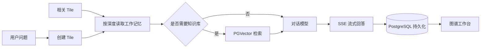

# Aureli Context Graph

Aureli Context Graph 是一个图式 AI 工作台：它把线性聊天拆成可连接的 **Tile**，让每个问题拥有独立上下文，同时允许用户显式选择相关节点、建立关系，并按需引入历史记忆与 RAG 知识。

项目包含 Spring Boot 后端和 Vue 3 管理控制台，可用于探索非线性对话、知识图谱式工作流、可控记忆与本地模型集成。

## 核心能力

- **图式对话**：每次提问生成独立 Tile，可从一个或多个既有 Tile 继续推演。
- **可控工作记忆**：不同 Tile 默认隔离，通过关系边和遍历深度显式引入上下文。
- **关系建模**：支持单向、双向关系，自定义关系类型、权重和说明。
- **RAG 知识库**：上传 Markdown 文档后异步向量化，通过 PGVector 完成语义检索。
- **智能检索路由**：先判断当前问题是否需要专业资料，只有必要时才访问向量库。
- **流式回答**：基于 SSE 返回模型输出，并将 Tile、消息和关系持久化。
- **运行时模型配置**：在页面中分别配置对话与向量模型，保存后对后续请求立即生效。
- **图谱工作台**：支持节点拖动、缩放、搜索、筛选、全屏阅读、同步和 JSON 导出。

## 工作原理



Tile 工作记忆与 RAG 知识库相互独立：关系边决定哪些对话历史可以参与回答，知识文档则作为所有 Tile 可检索的共享资料。

## 技术栈

| 层级 | 技术 |
| --- | --- |
| 后端 | Java 21、Spring Boot 4.1、Spring AI 2.0 |
| 数据访问 | MyBatis-Plus、PostgreSQL、PGVector、P6Spy |
| 模型接口 | OpenAI-compatible API（支持 Ollama 等本地服务） |
| 前端 | Vue 3、Vite、Lucide Vue |
| 其他 | Lombok、Log4j2、SSE |

## 项目结构

```text
.
├── frontend/                         # Vue 3 管理控制台
│   ├── src/                          # 页面、样式和交互逻辑
│   └── tests/                        # 前端协议与 UI 测试
├── knowledge-base/                   # 示例知识文档
├── src/main/java/com/aureli/ai/robot/
│   ├── advisor/                      # 工作记忆、RAG 与流式持久化
│   ├── controller/                   # 对话、工作区和模型配置接口
│   ├── domain/                       # 数据实体与 Mapper
│   ├── event/                        # 文档向量化事件
│   ├── prompt/                       # 集中管理的提示词模板
│   └── service/                      # 业务与运行时模型配置
├── src/main/resources/
│   ├── schema.sql                    # 应用数据表
│   └── static/                       # 已构建的前端资源
└── pom.xml
```

## 快速开始

### 1. 环境要求

- JDK 21
- Maven 3.9+
- Node.js 20+（仅前端开发需要）
- PostgreSQL 15+ 与 PGVector 扩展
- 一个兼容 OpenAI API 的对话与向量模型服务

本地运行可使用 Ollama：

```bash
ollama serve
ollama pull llama3
ollama pull qwen3-embedding:4b
```

### 2. 初始化数据库

创建数据库并启用扩展：

```sql
CREATE DATABASE robot;
```

连接到 `robot` 后执行：

```sql
CREATE EXTENSION IF NOT EXISTS vector;
CREATE EXTENSION IF NOT EXISTS "uuid-ossp";
```

开发环境默认启用 Spring SQL 初始化，启动时会执行 [`src/main/resources/schema.sql`](src/main/resources/schema.sql)。Spring AI 会使用 `t_vector_store` 保存向量数据。

### 3. 配置应用

数据库连接与知识文件目录位于 `src/main/resources/application-dev.yml`。请至少将以下值改为自己的环境：

```yaml
spring:
  datasource:
    url: jdbc:p6spy:postgresql://localhost:5432/robot
    username: postgres
    password: postgres

customer-service:
  md-storage-path: /absolute/path/to/your/Markdown
```

模型服务可通过环境变量覆盖：

| 环境变量 | 默认值 | 用途 |
| --- | --- | --- |
| `OLLAMA_BASE_URL` | `http://192.168.0.106:11434/v1` | OpenAI-compatible API 地址 |
| `OLLAMA_API_KEY` | `ollama` | API Key |
| `OLLAMA_CHAT_MODEL` | `llama3:latest` | 对话模型 |
| `OLLAMA_EMBEDDING_MODEL` | `qwen3-embedding:4b` | 向量模型 |

例如，本机 Ollama 通常可这样启动应用：

```bash
export OLLAMA_BASE_URL=http://localhost:11434/v1
mvn spring-boot:run
```

打开 [http://localhost:8080](http://localhost:8080) 即可进入管理控制台。

> 向量维度当前固定为 `1536`，必须与模型输出和 PGVector 表结构一致。更换向量模型后，应重新向量化已有文档。

## 前端开发

```bash
cd frontend
npm ci
npm run dev
```

开发服务器默认运行于 [http://127.0.0.1:5173](http://127.0.0.1:5173)，并将 `/customer-service` 代理到 `http://localhost:8080`。

构建生产资源：

```bash
npm run build
```

产物会写入 `src/main/resources/static`，随后由 Spring Boot 同源提供。更多细节见 [`frontend/README.md`](frontend/README.md)。

## 使用流程

1. 在「服务设置」中确认后端地址、对话模型和向量模型。
2. 在「知识库管理」上传 Markdown 文件，等待状态变为处理完成。
3. 在图谱工作台新建 Tile 并输入问题。
4. 选择一个或多个已有 Tile，设置关系方向、类型和说明，再继续提问。
5. 刷新或点击同步，从数据库恢复完整图谱和最新回答。

服务设置存入 PostgreSQL 的 `t_model_api_settings`。读取接口不会返回 API Key 原文；保存成功后，后续对话、文档向量化和 RAG 检索立即使用新配置，无需重启服务。

## 主要接口

| 方法 | 路径 | 说明 |
| --- | --- | --- |
| `POST` | `/customer-service/chat/tile/completion` | 创建 Tile 并以 SSE 返回回答 |
| `GET` | `/customer-service/tile/workspace` | 获取完整 Tile 与关系快照 |
| `POST` | `/customer-service/tile/reset` | 清空 Tile、消息和关系 |
| `POST` | `/customer-service/md/upload` | 上传 Markdown 文档 |
| `POST` | `/customer-service/md/list` | 分页查询知识文档 |
| `POST` | `/customer-service/md/update` | 更新文档信息 |
| `POST` | `/customer-service/md/delete` | 删除文档及相关向量 |
| `GET` | `/customer-service/model-settings` | 读取脱敏后的模型配置 |
| `POST` | `/customer-service/model-settings` | 保存并应用模型配置 |

Tile 问答示例：

```http
POST /customer-service/chat/tile/completion
Content-Type: application/json
Accept: text/event-stream
```

```json
{
  "message": "RAG 和 Agent 有什么区别？",
  "tileId": "tile-003",
  "relatedTileIds": ["tile-001", "tile-002"],
  "memoryDepth": 3,
  "edgeDirection": "DIRECTED",
  "relationType": "EXTENDS",
  "edgeWeight": 1,
  "edgeDescription": "从相关 Tile 继续追问"
}
```

SSE 数据对象使用 `v` 返回文本分片，以 `done: true` 表示完成；失败时返回 `error`。完整协议见 [`frontend/API-CONTRACT.md`](frontend/API-CONTRACT.md)。

## 验证

运行后端测试：

```bash
mvn test
```

运行前端测试与构建：

```bash
cd frontend
npm test
npm run build
```

真实 PostgreSQL、PGVector 与 Ollama 的联调记录见 [`frontend/LIVE-INTEGRATION.md`](frontend/LIVE-INTEGRATION.md)。

## 注意事项

- 重置工作区会删除所有 Tile、Tile 消息和关系边，操作不可撤销。
- Markdown 上传后会异步向量化，请等待处理完成再测试知识检索。
- 模型配置按后端实例即时生效；多实例部署不会自动同步其他实例的内存配置。
- 不要提交真实 API Key、生产数据库密码、运行日志或本地模型配置文件。

## License

This project is for learning and experimental use.
